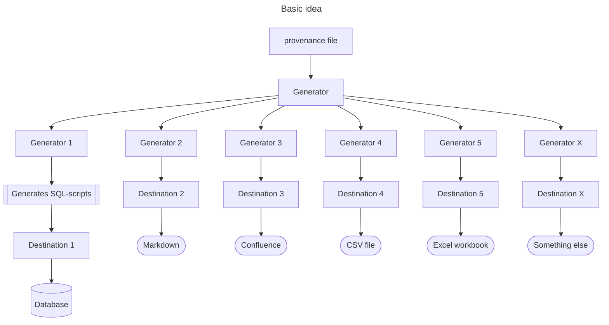

# Provenance

**One model. One truth. Endless outputs.** 

Provenance lets you define your data model in YAML or JSON and generate ER diagrams, SQL scripts, data lineage, data dictionaries, and more — all from a single source of truth.

> **Provenance** — In data, provenance means the authoritative origin of data.

This document covers:
- [Idea of Provenance](#idea-of-provenance)
- [Documentation structure](#provenance-structure)
- [Usage](#usage)

## Badges


---

## Idea of Provenance

The basic idea of *Provenance* is to have a single model and then generate 
and distribute provenance and artifacts into different places.

Each `Generator` generates something and a `Destination` can send the output to somewhere. 

Some generators are supplied in-the-box, but you're able to design your own generator and destinations.

The generators acts as plugin - Just implement `GeneratorConfiguration`.



---

## Documentation structure

The provenance file or files can be yaml- or json-files.

If you in the beginning of your file add a reference to the schema, so your IDE can validate and have code completion.

```yaml
$schema:  https://patrickfust.github.io/provenance/v1/provenance-schema.json
```

Example of a provenance file:

```yaml
$schema:  https://patrickfust.github.io/provenance/v1/provenance-schema.json
provenanceTitle: My database
schemaName: theSchema
tables:
  - name: table_a
    createTableScript: create_table_a.sql
    fields:
      - name: field_a
        dataType: int
        foreignKey:
          tableName: table_b
          columnName: field_b
          onDelete: cascade
  - name: table_b
    fields:
      - name: field_b
        dataType: int
  - name: table_in_group
    fields:
      - name: field_b
        dataType: int
```

or as JSON:
```json
{
    "$schema": "https://patrickfust.github.io/provenance/v1/provenance-schema.json",
    "provenanceTitle": "My database",
    "schemaName": "theSchema",
    "tables": [
        {
            "name": "table_a",
            "createTableScript": "create_table_a.sql",
            "fields": [
                {
                    "name": "field_a",
                    "dataType": "int",
                    "foreignKey": {
                        "tableName": "table_b",
                        "columnName": "field_b"
                    }
                }
            ]
        },
        {
            "name": "table_b",
            "fields": [
                {
                    "name": "field_b",
                    "dataType": "int"
                }
            ]
        },
        {
            "name": "table_in_group",
            "fields": [
                {
                    "name": "field_b",
                    "dataType": "int"
                }
            ]
        }
    ]
}
```

## Generator Configuration File

You can either configure your [Gradle](build-tools/provenance-gradle-plugin) directly, or have a configuration file.
The configuration file is the only way to use the [Maven plugin](build-tools/provenance-maven-plugin)

The generator configuration file contains a list of configurations.
Each configuration consist of the class name of the configuration class and then its fields.
You can have nested objects, you just have to specify which class name it is.

### Example of configuration file
```yaml
- className: dk.fust.provenance.generator.erdiagram.ERDiagramConfiguration
  provenanceFile: provenance.yaml
  umlGenerator: MERMAID
  generateKeys:
    - className: dk.fust.provenance.generator.erdiagram.GenerateKey
      destinationKey: MODEL_MERMAID_PLACEHOLDER
    - className: dk.fust.provenance.generator.erdiagram.GenerateKey
      destinationKey: MODEL_MERMAID_GROUP_PLACEHOLDER
      filterTags: my_group
  destination:
    className: dk.fust.provenance.destination.MarkdownDestination
    file: README.md
- className: dk.fust.provenance.generator.erdiagram.ERDiagramConfiguration
  provenanceFile: provenance.yaml
  umlGenerator : PLANTUML
  generateKeys:
    - className: dk.fust.provenance.generator.erdiagram.GenerateKey
      destinationKey: MODEL_PLANTUML_PLACEHOLDER
  destination:
    className: dk.fust.provenance.destination.MarkdownDestination
    file: README.md
```

---

## Usage

Read about how to use *Provenance*:

| Topic                                                        | Description                                           |
|--------------------------------------------------------------|-------------------------------------------------------|
| [Destinations](docs/destinations.md)                         | Where the generated provenance is sent to.            |
| [Table formats](docs/table-formats.md)                       | The format of the generated tables.                   |
| [Generation types](docs/generation-types.md)                 | The different types of generators that are available. |
| [Build tools - Gradle](build-tools/provenance-gradle-plugin) | How to use *Provenance* with Gradle.                  |
| [Build tools - Maven](build-tools/provenance-maven-plugin)   | How to use *Provenance* with Maven.                   |
